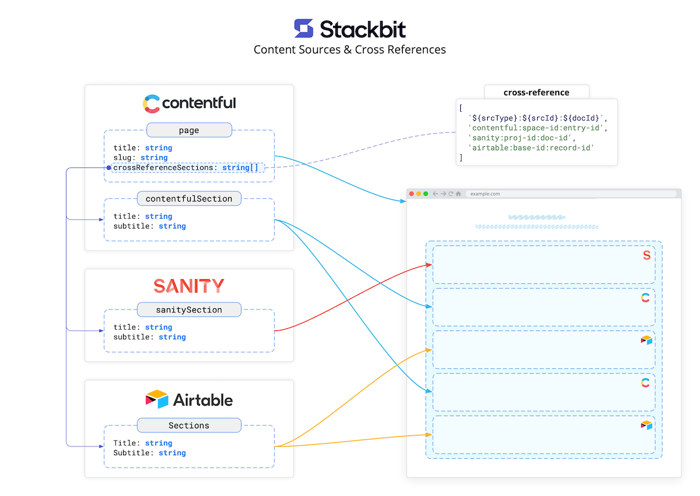
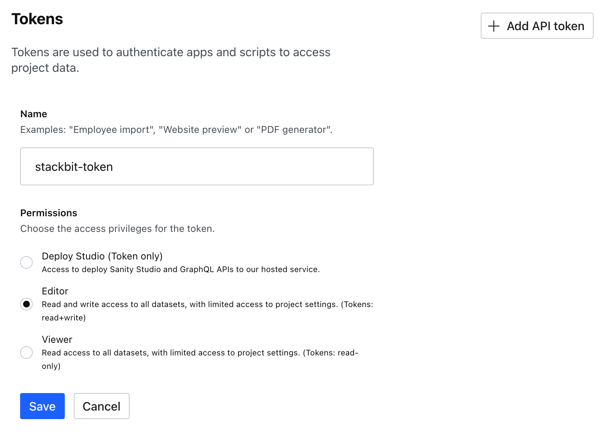
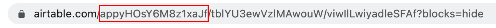
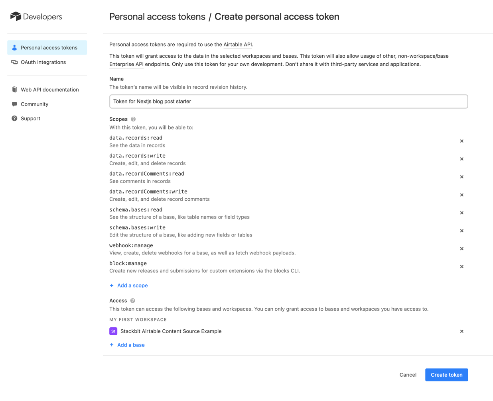
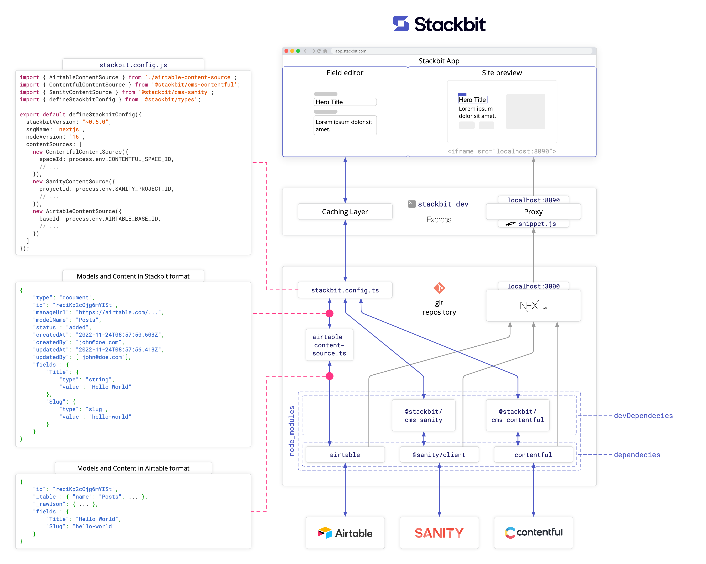
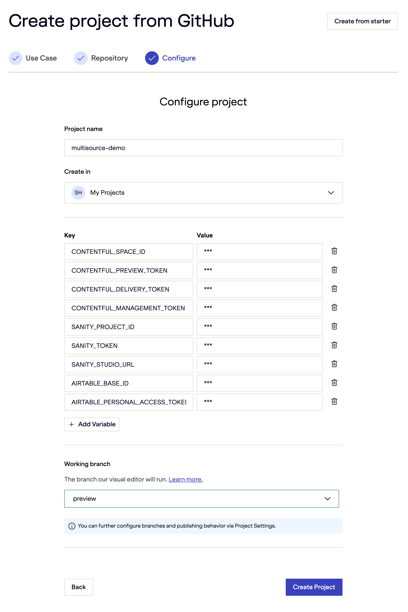

# Stackbit Multi Content Source Demo

This demo contains a simple [Next.js](https://nextjs.org/) site with pages that render content from 3 different content sources - Contentful, Sanity, and Airtable. This demo also includes the Stackbit configuration file [stackbit.config.ts](./stackbit.config.ts) needed to run the Stackbit dev server locally, which allows editing the site's content using [Stackbit](https://www.stackbit.com/) visual editor.

The content sources contain the following content models:

The [Contentful](https://www.contentful.com/) CMS has two content models:

- The `page` content model is used to render site pages. It has three fields - `slug`, `title`, and `crossReferenceSections`. The `crossReferenceSections` is Contentful's "array of strings" field mapped to the `cross-reference` field in Stackbit and used to reference content from other content sources.
- The `contentfulSection` content mode is used to render page sections. It has `title` and `subtitle` fields .

The [Sanity](https://www.sanity.io/) CMS has one content model defined in the [studio/schemas/schema.js](./studio/schemas/schema.js) file:
- The `sanitySection` model is used to render page sections. It has `title` and `subtitle` fields.

The [Airtable](https://airtable.com/) has one table:

- The `Sections` table is used to render the page sections. It has four fields - `Title`, `Subtitle`, `Status`, and `Related` columns. The `Status` and `Related` columns allow publishing workflows like Contentful and Sanity..

Next.js generates its pages from Contentful's `page` entries. These pages render a dynamic list of cross-referenced sections from all three content sources, including Contentful's sections. The list of cross-references contains a list of strings specifying the location of every section in the following format - `{srcType}:{srcId}:{docId}`, where every token has the following meaning:

- The `srcType` is the content source type defined in Stackbit configuration (e.g., `contentful`, `sanity`, `airtable`)
- The `srcId` is the ID of the content source. The values of IDs depend on the content source plugin implementation. In this case, these are Contentful Space ID, Sanity project ID, and Airtable base ID.
- The `docId` is the ID of a global document within a content source. In this case, there are Contentful entry IDs, Sanity document IDs, and Airtable record IDs.  



## Running Locally

1. Clone this repo
2. Install dependencies by running `npm install`
3. Create a `.env` file with the following environment variables.

```shell
CONTENTFUL_SPACE_ID=
CONTENTFUL_PREVIEW_TOKEN=
CONTENTFUL_DELIVERY_TOKEN=
CONTENTFUL_MANAGEMENT_TOKEN=

SANITY_PROJECT_ID=
SANITY_TOKEN=
SANITY_STUDIO_URL=

AIRTABLE_BASE_ID=
AIRTABLE_PERSONAL_ACCESS_TOKEN=
```

The following sections will take you through the steps needed to fill in the values of these variables and run the site locally. For security reasons, the `.env` file is included in `.gitignore` and is not committed to git.

### Creating Contentful Space

1. Login into Contentful and generate a new Contentful Personal Access Token. Click [here](https://app.contentful.com/account/profile/cma_tokens) to jump into the "Personal access tokens" in Contentful. Assign the generated token to the `CONTENTFUL_MANAGEMENT_TOKEN` environment variable.
2. Create a new Contentful Organization, then create a new Space. Assign the space ID to the `CONTENTFUL_SPACE_ID` environment variable.
3. Create a pair of Content Preview API and Content Delivery API access tokens for your new space. When in space, click **Settings** => **API Keys** => **Content delivery / preview tokens** => **Add API Key** (alternatively click the following link and replace the `CONTENTFUL_SPACE_ID` with your space ID https://app.contentful.com/spaces/CONTENTFUL_SPACE_ID/api/keys). Assign the tokens to the `CONTENTFUL_PREVIEW_TOKEN` and the `CONTENTFUL_DELIVERY_TOKEN` environment variables.
4. Import the initial content into your new Contentful space by running the following node script (the script will use the environment variables you set in the previous steps to provision your Contentful space):

    ```shell
    ./contentful-export/import.js
    ```
5. You may validate that the import worked by checking that your Contentful space has `Page` and `Section` Content Models as well as several content entries.

### Creating Sanity Project

1. Install the Sanity CLI package and login into Sanity by running the following commands (this will open a browser and walk you through the authentication process). This process will create a Sanity token needed to create and provision a Sanity project in the following steps.

    ```shell
    npm install -g @sanity/cli
    sanity login
    ```

2. Once authenticated, run the following command to create a new Sanity project. Assign the project ID printed in the console to the `SANITY_PROJECT_ID` environment variable.
    
    ```shell
    ./sanity-export/create-project.js
    ```
   
3. Sign in to Sanity in the browser and rename your project if needed. You can find your Sanity project at the following URL https://www.sanity.io/manage/personal/project/SANITY_PROJECT_ID (replace the `SANITY_PROJECT_ID` with your Sanity project ID). Click on the "API" tab, then click "Add API token" to generate a new API token. Provide a name for the token, select the "Editor" under the "Permissions" section, and click "Save". Assign the generated API token to the `SANITY_TOKEN` environment variable.
    
   

4. Run the following command to import the initial content into the Sanity project:

    ```
    ./sanity-export/import.js
    ```
   
5. Install Sanity Studio:

    ```
    cd studio
    npm install
    ```

6. You may validate that the content was imported by starting the Sanity Studio by running `npm start` (inside the `studio` folder), then open your browser and navigate to http://localhost:3333 and validate that you can see and edit the content.
7. You may also deploy Sanity Studio by running `sanity deploy` to deploy Sanity Studio to a remote URL (`<value>.sanity.studio`). Once deployed, assign the remote Sanity Studio URL to the `SANITY_STUDIO_URL` environment variable.

### Creating Airtable Base

1. Navigate to this Airtable link: https://airtable.com/shrhUprgx7Sjm9UdO and click "Copy base" on the top of the page (you will need to create an Airtable account).
2. Assign the "Base ID" to the `AIRTABLE_BASE_ID` environment variable. The Base ID is the first part between the slashes that comes after `airtable.com` and starts with the letters `app`:

   

3. Navigate to your Airtable account page (https://airtable.com/account) and click "Create token" to generate a Personal Access Token. Select all the "Scopes" and select the newly created base in the "Access" section:
    
   

4. Assign the generated token to the `AIRTABLE_PERSONAL_ACCESS_TOKEN` environment variable.

### Running Next.js

Run `npm run dev` (in your project's root folder) to start the Next.js development server. Your site should be up and running on [http://localhost:3000](http://localhost:3000). You should see an empty page with a "Welcome to Stackbit" header.

## Running Stackbit dev

While the Next.js development server is running, open a new terminal window and install stackbit CLI by running: 

```shell
npm install -g @stackbit/cli
```

Run `stackbit dev` to start a local Stackbit development server. Once the server starts, it will print the following link to the console:

```
info: ⚡ Open http://localhost:8090/_stackbit in your browser
```

Click the link to open Stackbit in your browser. You will need to sign in with Stackbit.

You can now start editing your site visually in Stackbit! Try editing, creating, reordering, and deleting the cross-referenced page sections. You can open your content sources in separate browser tabs to see how Stackbit updates your content sources.

All Stackbit configuration is defined inside the [`stackbit.config.ts`](./stackbit.config.ts) file. The  `stackbit.config.ts` contains content-source modules allowing Stackbit to read and write the content from content sources when you use the Stackbit interface. Every content-source module implements the ContentSourceInterface.

One of the important Stackbit concepts is to allow developers to develop their sites using the tools of their choice without imposing requirements on external packages, specialized component wrappers, additional APIs, and anything else that may introduce a hard dependency on Stackbit. Therefore, neither the `stackbit.config.ts` nor its content-source modules interact or interfere with the website's code in any way. The Stackbit development server runs in parallel to the front-end web framework's development server, and when building and deploying the site for production, all Stackbit-related files are ignored.

The following diagram illustrates how the data flows between Next.js and content sources and between Stackbit and content sources. The `stackbit.config.ts` dependencies can be included as `devDependencies`, as your site doesn't need them when running or building for production. 



To learn more about Stackbit and how it works, please visit the following resources:

- [Getting Started](https://docs.stackbit.com/getting-started)
- [Stackbit Concepts](https://docs.stackbit.com/concepts)
- [Stackbit Reference](https://docs.stackbit.com/reference)

## Running in Stackbit

After you have run your site locally and ensured that everything works as expected, it's time to import your site into Stackbit. This will allow you to work on your project remotely, share the preview of your site with your team before publishing it, and let your teammates collaborate with you on your site.

1. Publish the cloned repo to your personal GitHub repository.
2. Navigate to https://app.stackbit.com/import, select "**Use my repository**", and click "Next".
3. Connect GitHub if needed, find and select your repository, and click "Next".
4. In the "Configure" step, choose the project name, add the same environment variables you defined in your local `.env` file and click "Create Project"

   
